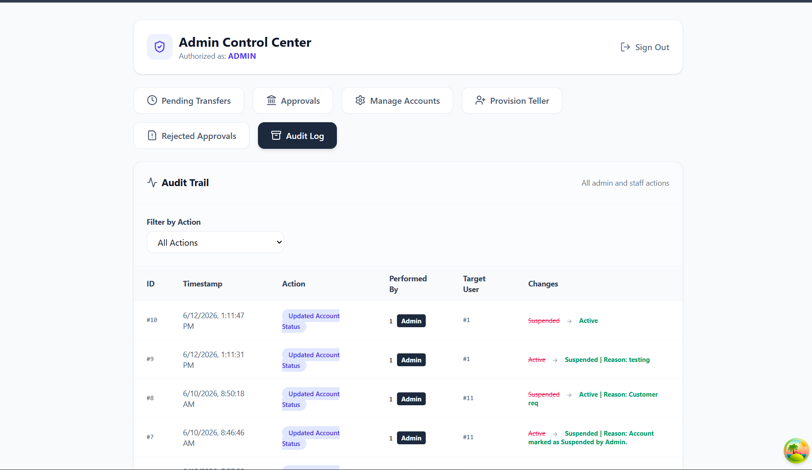
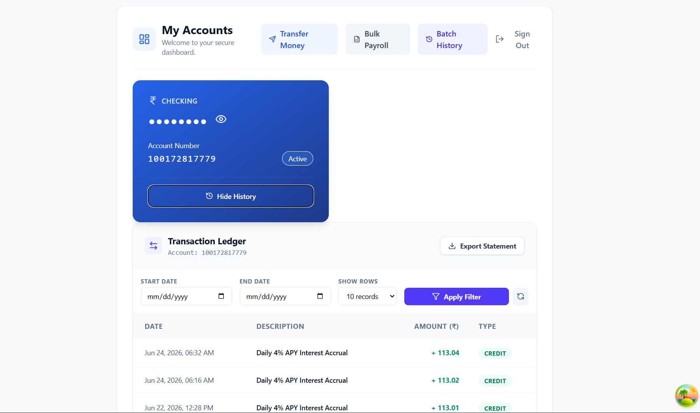
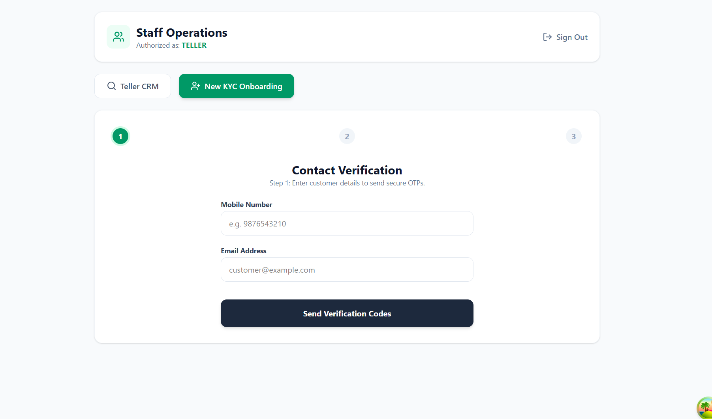
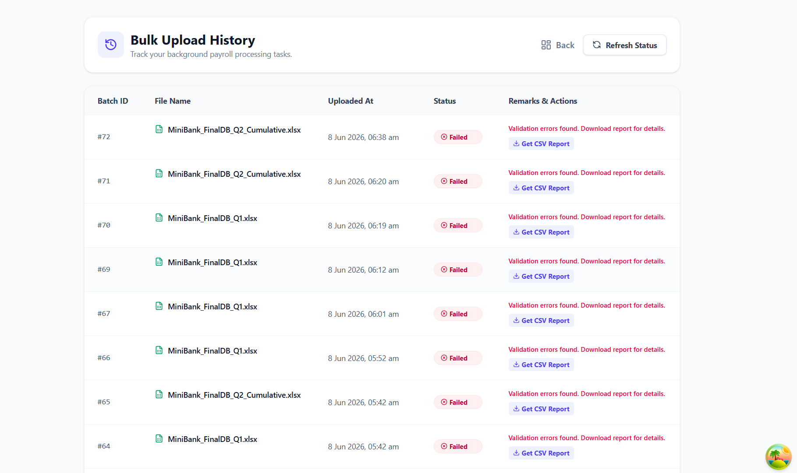

# 🏦 MiniBank: Enterprise Core Banking Platform

MiniBank is a full-stack, role-based core banking platform designed to simulate enterprise financial workflows. Built with a **C# .NET Minimal API** backend and a **React TypeScript** frontend, this platform enforces strict financial compliance, secure over-the-counter (OTC) processing, and idempotency guarantees.

Developed by **Sharad Shinde**.

---

## ✨ Enterprise Architecture & Key Features

This project was built to go beyond standard CRUD operations, focusing on the security and architectural patterns required in real-world financial technology.

### 🛡️ 1. Maker-Checker Approval Workflow
High-value transfers requested by users are intercepted and placed into a `Pending` state. The system enforces **Segregation of Duties**, requiring a CTO/Admin to physically review and execute the transaction via a secure Control Center. 

### 🔒 2. Idempotent Transactions (`X-Idempotency-Key`)
To prevent accidental double-charging due to network latency or user double-clicks, the React frontend generates a unique `uuid` for every transfer attempt. The C# backend verifies this key, ensuring that identical transaction requests are processed exactly once.

### 📖 3. Immutable Double-Entry Ledger
Financial data is never overwritten. Every transaction (deposits, withdrawals, transfers) generates balanced, immutable `LedgerEntry` records (Credits and Debits) linked to a parent `TransactionRecord`, ensuring 100% auditability.

### 👥 4. Role-Based Access Control (RBAC) & Custom Dashboards
The application serves three distinct JWT-authenticated experiences:
* **Customer Portal:** View accounts, generate paginated transaction histories, initiate internal transfers, and execute Bulk Payroll uploads via multipart/form-data.
* **Teller CRM:** Securely search customers via 12-digit Account IDs, process OTC cash deposits/withdrawals linked to a Central Vault, and update KYC contact details.
* **Admin Control Center:** Provision new staff, approve/reject pending transfers, activate newly onboarded accounts, and review the read-only Compliance Audit Log.

### 🔐 5. Zero-Trust Security & Air-Gapped Portals
Replaced vulnerable LocalStorage JWTs with **Secure, HttpOnly, Strict SameSite Cookies** and custom **Anti-CSRF** validation middleware. The backend strictly air-gaps Customer and Staff API boundaries to completely eliminate cross-contamination and authentication bypass vulnerabilities.

### ⚙️ 6. Asynchronous Processing & Cron Jobs
Integrated **Hangfire** to offload slow network calls (like SMS and Email OTP dispatching) from the main HTTP thread to background queues, ensuring the API responds in milliseconds. Also includes automated daily background workers to calculate and distribute APY interest.

### 🧱 7. Feature-Sliced Frontend Architecture
The React application is modularized using a **Domain-Driven Design**, dismantling massive monolithic UI components. Server state is managed by **TanStack Query** (caching/optimistic updates), while forms utilize **React Hook Form + Zod** for zero-latency, mathematically strict schema validation.

### 📝 8. Global Audit Logging & Compliance
A custom C# Middleware automatically intercepts and logs all critical state changes (e.g., account suspensions, bulk payroll executions) to an immutable `AuditLog` table. It tracks the exact `AdminId`, action, previous state, and timestamp for SOC2/PCI-style compliance.

---

## 🛠️ Technology Stack

**Frontend (Client)**
* **Framework:** React 18 with Vite
* **Language:** TypeScript
* **Styling:** Tailwind CSS + Lucide Icons
* **State Management & Fetching:** React Hooks, Axios (with interceptors)

**Backend (API)**
* **Framework:** .NET 8 (Minimal APIs)
* **Language:** C#
* **ORM & Database:** Entity Framework Core (EF Core)
* **Security:** JWT Bearer Authentication, BCrypt Password Hashing
* **Validation:** FluentValidation
** BackGroundworker** Hangfire

---
## previews 
   Admin Dashboard: 
   

   Cutomer Dashboard: 
   

   Teller / CTO dashbaord : 
   

  # * ** Working with XLSX files : **
   
---
---

## 🚀 Quick Start Guide (Local Development)

### 1. Backend Setup (.NET 8)
1. Open the `MiniBank-backend` folder in Visual Studio or your preferred IDE.
2. Ensure you have the **.NET 8 SDK** installed.
3. Build  (`dotnet build`), and Run the application (Press `F5` or use `dotnet run`).
   * **Automated Setup:** The application will automatically create the local SQL Database and apply all EF Core migrations on startup. No manual `Update-Database` required!

> ⚠️ **Notice for macOS / Linux Evaluators:**
> Microsoft `LocalDB` is native to Windows. If you are evaluating this project on macOS or Linux, please update the `DefaultConnection` string in `MiniBank-backend/appsettings.json` to point to your local SQL Server Docker container (e.g., `Server=localhost,1433;Database=MiniBank...`). The startup script will still handle the automatic database generation for you!

### 2. Frontend Setup (React + Vite)
1. Open the `minibank-frontend` folder in a new terminal.
2. Run `npm install` to download dependencies.
3. make sure we have .env file or Rename the `.env.example` file to `.env`. 
4. Ensure `VITE_API_URL` inside `.env` matches the port your C# backend is running on.
5. Run `npm run dev`.

---

## 🔑 How to Test Authentication & OTPs

This application features an air-gapped authentication matrix between Customers and Staff. 

**Development vs. Production OTPs:**
To prevent SMS/Email charges during development and evaluation, the backend Notification Service intercepts the OTPs. 
* When you request an OTP on the frontend, **look at the C# Backend Console/Terminal window.** * The 6-digit OTP will be printed directly in the console like this: `[SMS] Your MiniBank verification code is: 123456`.
* *(In a Production environment, Hangfire background workers dispatch this exact message to AWS SNS / SMTP servers).*

### Test Credentials (Seeded Data)
To get started, you can use the following seeded accounts. **Because temporary passwords require a reset, please use the 'OTP Code' login method for Staff.**

**👨‍💼 Admin Control Center (Staff Login Portal):**
* **Login ID:** `admin@minibank.com`
* **Method:** Select the **"OTP Code"** toggle on the login screen. Check the C# console for the 6-digit code.

**👔 CTO / Teller (Staff Login Portal):**
* **Login ID:** `shindesharad9325@gmail.com`
* **Method:** Select the **"OTP Code"** toggle. Check the C# console.

**👤 Customer Portal:**
* **Login ID (Account Number):** `522093205024`
* **Method:** Enter ID, click send OTP, and retrieve the code from the C# console.

From the Admin Dashboard, navigate to "Provision Staff" to create a brand new staff member and explore the Maker-Checker workflow!